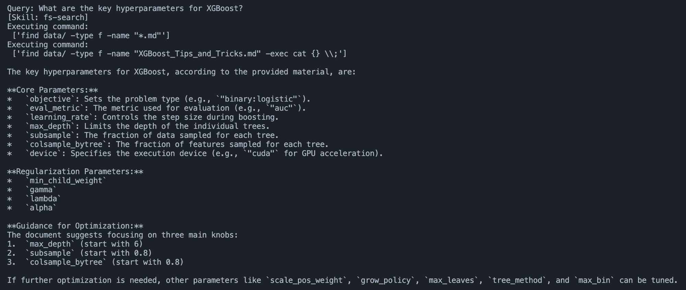

# jina-grep

A LangChain agent with a **dynamic skill system** — routes user queries to the appropriate skill at runtime, then executes the selected skill's instructions using shell tools.

## Demo



## How It Works

```
User Query
    │
    ▼
┌─────────────┐     skill name     ┌──────────────────┐
│ Router LLM  │ ─────────────────► │  SkillRegistry   │
│             │                    │  (skills/*.md)   │
└─────────────┘                    └────────┬─────────┘
                                            │ skill content
                                            ▼
                                   ┌─────────────────┐
                                   │  Agent LLM      │
                                   │  + ShellTool    │
                                   └────────┬────────┘
                                            │
                              Thought → Action → Observation
                                            │
                                            ▼
                                        Answer
```

1. **Router** — a lightweight LLM call selects the best skill based on the skill descriptions and the user's query
2. **SkillRegistry** — loads all `skills/*.md` files at startup, parsing frontmatter (`name`, `description`) and body (system prompt)
3. **Agent** — `create_agent()` receives the selected skill's content as `system_prompt` and `ShellTool` for executing shell commands in the `data/` directory

## Project Structure

```
jina-grep/
├── skills/
│   └── fs_search.md        # skill: exact filesystem search (find/grep/cat)
├── data/                   # files the agent is allowed to query
├── skill_registry.py       # loads and indexes skill files
├── main.py                 # router + agent loop
└── pyproject.toml
```

## Skills

Skills are plain Markdown files with a YAML frontmatter header:

```markdown
---
name: fs-search
description: Exact search within the filesystem. Use for known filenames, exact keywords, or simple file listing via find/grep/cat.
---
You are a search agent ...
```

| Field         | Purpose                                                     |
|---------------|-------------------------------------------------------------|
| `name`        | Unique identifier used for routing and lookup               |
| `description` | One-line summary shown to the router LLM for skill selection |
| Body          | Full system prompt injected into the agent at runtime        |

**Adding a new skill** requires no code changes — drop a new `.md` file into `skills/` and it will be picked up automatically on the next run.

## Prerequisites

- [Ollama](https://ollama.com) running locally with your model pulled:
  ```bash
  ollama pull gemma4:e4b-nvfp4
  ```
- [uv](https://docs.astral.sh/uv/) for dependency management

## Installation

```bash
git clone <repo-url>
cd jina-grep
uv sync
```

## Usage

```bash
uv run main.py
```

```
Dynamic Skill Agent (Ctrl+C to exit)

Query: What are the key hyperparameters for XGBoost?
[Skill: fs-search]
Executing command: find data/ -type f -name "*.md"
...
```

To change the model, update the `model` parameter in `main.py`:

```python
llm = ChatOllama(model="your-model-name")
```

## Dependencies

| Package                  | Version   |
|--------------------------|-----------|
| `langchain`              | ≥ 1.2.15  |
| `langchain-community`    | ≥ 0.4.1   |
| `langchain-ollama`       | ≥ 1.1.0   |
| `langchain-experimental` | ≥ 0.4.1   |
